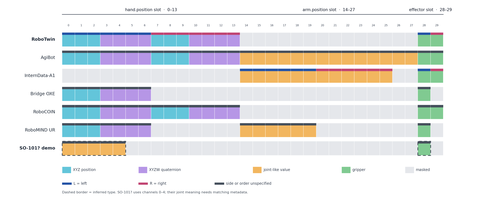

# Zero-WAM action space audit

The model's action tensor has 30 channels, but its coordinates are defined by each embodiment's preprocessing and normalization. The three capacity blocks in [lerobot_action.py](../third_party/Zero-WAM/wan_va/dataset/lerobot_action.py) are `action.hand.position` at 0–13, `action.arm.position` at 14–27, and `action.effector.position` at 28–29. A field shorter than its block occupies the first channels and masks the rest. The names do not specify a universal robot or control mode.

Different robots are not sharing one set of physical actuators. During training, each dataset's transform packs its own pose, joint, and gripper values into this fixed-width tensor and normalizes active fields with that dataset's q01/q99 statistics. The [training loss](../third_party/Zero-WAM/wan_va/train.py) ignores inactive channels through `actions_mask`. At inference, the chosen [server config](../third_party/Zero-WAM/wan_va/wan_va_server.py) selects active channels and denormalizes them, while the robot client must turn those values into commands in its own frame and units. The policy sees the robot camera/history context and predicts actions on the active slots; the 30-channel width is a common neural interface, not a universal actuator list. The [paper](2608.26103.txt) reports more than 45 training embodiments, so these rows are not variants of one robot.

The figure's [TikZ source](figures/zero_wam_action_channels.tex) is editable. The header names are capacity slots, so the same indices can hold pose coordinates for RoboTwin and joint-like values for the demo. An unspecified-side stripe means the inspected metadata did not explicitly identify left/right ordering; it does not mean the source robot lacks two arms. The dashed SO-101 row is an inference from the demo images and config, rather than a released action transform.

## Action mappings and evidence

| Source                                                                                                                                                                             | Active channels    | Meaning and conversion                                                                                                                                                                                                                                                                                                                                                                                                                                                                                                                                                                      |
| ---------------------------------------------------------------------------------------------------------------------------------------------------------------------------------- | ------------------ | ------------------------------------------------------------------------------------------------------------------------------------------------------------------------------------------------------------------------------------------------------------------------------------------------------------------------------------------------------------------------------------------------------------------------------------------------------------------------------------------------------------------------------------------------------------------------------------------- |
| RoboTwin post-train                                                                                                                                                                | 0–6, 7–13, 28–29   | Left and right end-effector XYZ plus XYZW quaternion; two continuous grippers. [robotwin_action.py](../third_party/Zero-WAM/wan_va/dataset/robotwin_action.py) subtracts each rollout's initial XYZ, uses `q_initial⁻¹ * q_target` for orientation, and leaves grippers absolute. The XYZ difference remains in the original frame. Channels 14–27 are masked.                                                                                                                                                                                                                            |
| [AgiBot released metadata](https://huggingface.co/datasets/Robbyant-Research/HumanGen/blob/971d12e942bf101c0d47716f928b1c044d02ac71/agibot_data/part-00000.tar.zst)                | 0–13, 14–27, 28–29 | Collection-level `agibot_data/meta/action_transform.yaml` maps `actions.end.position` and `actions.end.orientation` to two XYZ+quaternion hand poses, `actions.joint.position` to 14 arm joint values, and `actions.effector.position` to two effector values. Poses and joints are converted relative to the first aligned state. The effector values use `use_absolute: true`. Waist and head fields are present in metadata but are outside the model's three output blocks.                                                                                                             |
| [InternData-A1 Aloha released metadata](https://huggingface.co/datasets/Robbyant-Research/HumanGen/blob/971d12e942bf101c0d47716f928b1c044d02ac71/interna1_data/part-00000.tar.zst) | 14–25, 28–29       | `interna1_data/interna1_aloha/meta/action_transform.yaml` maps six left and six right joint positions to the arm block and one gripper position per side to the effector block. Joints are converted relative to the first aligned state; grippers use `use_absolute: true`. The hand block and arm channels 26–27 are masked.                                                                                                                                                                                                                                                              |
| [Bridge/OXE released metadata](https://huggingface.co/datasets/Robbyant-Research/HumanGen/blob/971d12e942bf101c0d47716f928b1c044d02ac71/oxe_data/part-00002.tar.zst)               | 0–6, 28            | Collection-level `oxe_data/bridge_oxe/meta/action_transform.yaml` takes six pose values from `observation.state[0:6]` as XYZ+Euler, converts them to a 7D pose relative to the first aligned state, and takes `observation.state[7]` as an absolute gripper value. No arm-block channels are used.                                                                                                                                                                                                                                                                                          |
| [RoboCOIN Aloha released metadata](https://huggingface.co/datasets/Robbyant-Research/HumanGen/blob/971d12e942bf101c0d47716f928b1c044d02ac71/robocoin_data/part-00009.tar.zst)      | 0–13, 28–29        | `robocoin_data/RoboCOIN_Split_aloha/meta/action_transform.yaml` takes 12 values from `eef_sim_pose_state` as two XYZ+Euler poses and converts them to two 7D relative poses. Two `gripper_open_scale_state` values are absolute. The arm block is masked.                                                                                                                                                                                                                                                                                                                                   |
| [RoboMIND UR released metadata](https://huggingface.co/datasets/Robbyant-Research/HumanGen/blob/971d12e942bf101c0d47716f928b1c044d02ac71/robomind_data/part-00004.tar.zst)         | 0–6, 14–19, 28     | `robomind_data/robomind_ur/meta/action_transform.yaml` maps `observation.states.end_effector` from XYZ+Euler to a 7D relative pose, six `actions.joint_position` values to initial-state-relative arm joints, and the seventh joint-position value to an absolute effector. The hand pose target is sourced from an observation field, not an `actions.*` field.                                                                                                                                                                                                                            |
| Franka example config                                                                                                                                                              | 0–13, 28–29        | [va_franka_cfg.py](../third_party/Zero-WAM/wan_va/configs/va_franka_cfg.py) selects the same 16 channels as RoboTwin but supplies different quantiles. This selection alone does not establish Franka's pose frame or target convention; its model path is a placeholder.                                                                                                                                                                                                                                                                                                                 |
| Assumed SO-101 demo                                                                                                                                                                | 0–4, 28            | The [top](../third_party/Zero-WAM/example/demo/observation.images.top.png) and [wrist](../third_party/Zero-WAM/example/demo/observation.images.wrist.png) example images appear to show an SO-101. [va_demo_cfg.py](../third_party/Zero-WAM/wan_va/configs/va_demo_cfg.py) selects five values in the `hand.position` capacity block and one in the `effector.position` block. Degree-like quantiles suggest five arm joint values; the remaining channel has a 0–100 gripper scale. The config does not name SO-101, specify joint order or conversion, or supply a matching checkpoint. |

The released LeRobot processor reads each task's `meta/action_transform.yaml` and `meta/action_stats.json`, rather than deriving action type from a training config. An action with `absolute_value: true` is converted from its initial aligned state unless `use_absolute: true` is set. Joint format subtracts initial joint values. Pose formats support XYZ with quaternion (`xyzq`), Euler angles (`xyze`), or rotation vector (`xyza`), including dual-pose forms. Quaternion orientation is relative to the initial orientation. XYZ is a world-frame difference by default; `use_local_frame: true` rotates it into the initial local frame. Each active field then uses its own released q01/q99 statistics. See [lerobot_action.py](../third_party/Zero-WAM/wan_va/dataset/lerobot_action.py).

The five released metadata entries above were read from the named archive members in the pinned [HumanGen release](https://huggingface.co/datasets/Robbyant-Research/HumanGen/tree/971d12e942bf101c0d47716f928b1c044d02ac71). The associated `action_stats.json` files confirm normalized field widths: AgiBot 14/14/2, InternData-A1 Aloha 12/2, Bridge/OXE 7/1, RoboCOIN Aloha 14/2, and RoboMIND UR 7/6/1. For `xyze` input, the processor emits quaternion orientation, so a six-value source pose occupies seven model channels. These examples show that the same 30 channels can carry different control types; they do not establish a single mapping for every task in a collection.

The two `example/demo` images, `va_demo_cfg.py`, and `va_demo_i2va.py` all first appear in Zero-WAM commit [08e2c4a](https://github.com/robbyant-research/Zero-WAM/commit/08e2c4ae41e2b63573a299825cebe6753481407c), “Initial public release” (September 15, 2026). The independent lineage check found the same demo channel selection and quantiles, plus byte-identical images, in the earlier [LingBot-VA commit](https://github.com/Robbyant/lingbot-va/commit/62abff76a4fcd516b5d89977bca25aec96e90e76) `62abff7`, “add new training demo” (February 27, 2026). That commit also added a [va_demo_train_cfg.py](https://github.com/Robbyant/lingbot-va/blob/62abff76a4fcd516b5d89977bca25aec96e90e76/wan_va/configs/va_demo_train_cfg.py) with `dataset_path = '/path/to/your/dataset'`. Neither release names the robot or provides an `action_transform.yaml` for this demo. The five-channel choice may be an example dataset convention; it is not evidence that a released checkpoint supports SO-101.

### What the demo quantiles imply

| Channel | Demo q01–q99 | Local SO-101 `action` q01–q99, episode 000 |
| --- | ---: | ---: |
| 0 | −90.60 to 71.74 | −31.75 to 59.59 |
| 1 | −98.73 to 65.89 | −82.94 to 24.81 |
| 2 | −79.90 to 92.88 | −30.83 to 81.38 |
| 3 | 48.95 to 100.00 | 44.92 to 95.00 |
| 4 | −32.79 to 22.78 | −157.21 to −32.49 |
| 28 | 0.83 to 100.00 | 0.24 to 71.59 |

The local example's [feature names](../data/examples/so101_libero_basket/episode_000/meta/info.json) identify five arm joints followed by a gripper; its [recorded statistics](../data/examples/so101_libero_basket/episode_000/meta/stats.json) use degree-scale joint values. The fifth joint covers a different part of its range, so these are compatible scales, not matching distributions. The local [SO-101 README](../sim/so101/README.md) documents a 0–100 LeRobot gripper convention. By contrast, RoboTwin's hand-block XYZ quantiles are within about ±0.4 and its quaternion components within ±1, while the demo's first five channels reach roughly ±100. The demo quantiles are implausible as XYZ/quaternion values in those units and consistent with absolute joint angles plus a gripper.

The [LingBot-VA training code at the originating commit](https://github.com/Robbyant/lingbot-va/blob/62abff76a4fcd516b5d89977bca25aec96e90e76/wan_va/dataset/lerobot_latent_dataset.py) reads a raw six-value `action`. For `env_type='none'`, it skips RoboTwin's relative-pose conversion, then scatters those six values into the selected 30-channel positions with `inverse_used_action_channel_ids`. The demo's nonzero quantiles occupy precisely channels 0–4 and 28. This makes the slot placement internally consistent and likely deliberate for the example training path, even though `hand.position` is a misleading name for joint-like values. Quantiles cannot prove the robot identity or rule out a deeper dataset/packing mistake; neither the original demo dataset nor a matching checkpoint is public here.

The chronology helps explain the naming mismatch. The February 2026 LingBot-VA commit did not contain `lerobot_action.py` or its named three-block layout; it used config-selected indices and masks in a 30-channel tensor. Zero-WAM's metadata-driven `hand.position`/`arm.position`/`effector.position` layout appeared in its September 2026 public release, which also carried forward the older demo assets. Thus the block names are a convention of Zero-WAM's released LeRobot processor, not evidence of a universally enforced model-output schema. A separately trained demo checkpoint could learn the older packing; the released RoboTwin checkpoint should not be expected to interpret those joint-like values correctly merely by switching configs.

## Still to verify before an SO-101 adapter

These collection-level transforms establish the mappings for Bridge/OXE, RoboCOIN Aloha, and RoboMIND UR. Other subcollections or task-level overrides still require their own metadata checks; the processor prefers a task's `meta/action_transform.yaml` when present. Franka's target frame likewise needs its training metadata or inference client. Assuming the demo robot is SO-101, its selected channels are 0–4 and 28, but their joint order, units, absolute-versus-relative conversion, and inverse simulator mapping still need matching training metadata or a documented client. A compatible checkpoint is also needed; switching the RoboTwin checkpoint to `va_demo_cfg` is not a validated adapter.
