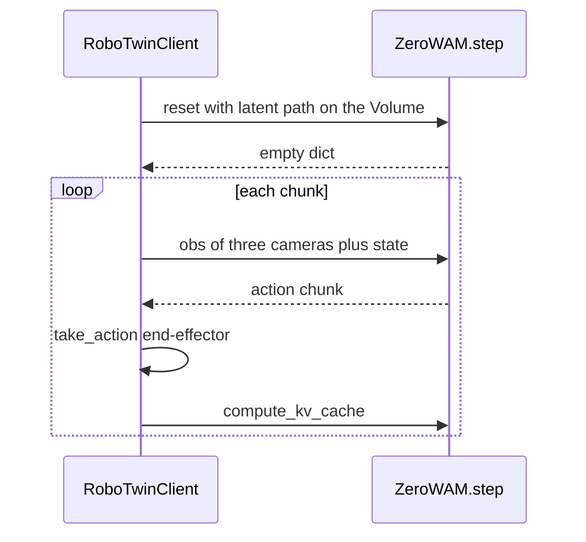

# Zero-WAM inference plan

Run closed-loop rollouts of the released RoboTwin post-train checkpoint. The simulator stays on this machine. The 11B model runs on a single Modal GPU. Text, published HumanGen latent, and raw MP4 conditioning have all completed `place_empty_cup` episodes; see the [execution tracker](zero_wam_execution_tracker.md) for results and commands.

Sources: [project page](https://robbyant-research.github.io/Zero-WAM/), [paper](2608.26103.pdf) ([text](2608.26103.txt)), [code](https://github.com/robbyant-research/Zero-WAM), [post-train weights](https://huggingface.co/Robbyant-Research/zero-wam-posttrain-robotwin), [HumanGen](https://huggingface.co/datasets/Robbyant-Research/HumanGen), [RoboTwin install](https://robotwin-platform.github.io/doc/usage/robotwin-install.html).

## Decision

Use RoboTwin 2.0 task `place_empty_cup` with `zero-wam-posttrain-robotwin`. That is the only closed-loop path the authors shipped. `place_empty_cup` is the strongest reported unseen task (84.87% in the paper). The instruction is one-arm ("place the empty cup on the coaster"). The robot is still a dual-arm Aloha: 16-D end-effector, left xyz + quaternion + gripper, then the same for the right arm. The released LeRobot metadata says `"robot_type": "aloha"`. The model’s internal action vector is 30-D; only 16 channels are used.

Post-training is a mixture, not RoboTwin alone. Section 4.2 starts from the pre-trained checkpoint and, for 4,000 steps, samples Task-diverse VA, HumanGen, and RoboTwin at 2:10:3. Task-diverse VA is language-only robot video. HumanGen adds a paired human video on top of the language instruction; the action branch never attends to that video. Simulation ICL is the RoboTwin slice of HumanGen (43 seen tasks, 7 held out). It is listed separately in the ratio so those 2,150 pairs are upweighted and the seven eval tasks stay excluded. The real bimanual-Franka pairs are a different post-train and are not this checkpoint.

Open X-Embodiment in that mixture includes single-arm Bridge / WidowX. The released server denormalizes actions with `wan_va/assets/norm_stats/robotwin_icl.json`, and the only shipped client is RoboTwin. A Bridge rollout would be a new client. This repo’s SO-101 MuJoCo scene is a different arm and a different action space.

The [action space audit](zero_wam_action_space.md) records the 30-channel layout and verifies five released HumanGen action transforms. Its mappings should be checked before designing an SO-101 adapter or changing model configs.

## How a rollout is split

`VA_Server.infer` is three calls against one process. `reset` encodes the human video once and stores it as prefix memory. Later calls send the latest three camera frames plus proprioception and return the next action chunk (chunk size 2, 16 actions per frame, 50 denoising steps). A cache miss is a wrong action: the client does not resend the episode.

Inference is one GPU. The official launcher is already `torch.distributed.run --nproc_per_node 1`. On Modal, `max_containers=1` on a single `A100-80GB` is what makes every call hit that process. Sticky `Modal-Session-ID` routing is not a substitute. Modal rebalances sessions when the container set changes.

A public HTTP server, as in the [vLLM](https://modal.com/docs/examples/vllm_inference), [SGLang](https://modal.com/docs/examples/sglang_low_latency), and [DeepSeek-V4-Flash](https://modal.com/docs/examples/deepseek_v4_flash) examples, and `modal.forward`, stay out. Those fit a request that carries its own prompt.



This machine is an RTX 3070 Laptop with 8 GB. It runs SAPIEN only. The published checkpoint files total about 37 GB on disk. A Modal A100-80GB completed both text and video-conditioned episodes; the video rerun reported about 32 GiB allocated after load and a 38.2 GiB peak as its KV cache grew.

## Modal app

Implementation: `zero_wam/modal_app.py`.

- Image: Python 3.12, torch 2.9.0 / torchvision 0.24.0 / torchaudio 2.9.0 from the cu126 index, then Zero-WAM's inference requirements and the matching official FlashAttention wheel. LeRobot and Weights & Biases are omitted because they are only needed for training and LeRobot 0.3.3 conflicts with PyTorch 2.9. `decord` reads the HumanGen MP4. The upstream checkout is copied into the image; weights stay on the Volume.
- Volume `zero-wam-weights`, mounted at `/models`. A one-shot function runs `snapshot_download("Robbyant-Research/zero-wam-posttrain-robotwin")` and the `place_empty_cup` human latent from `Robbyant-Research/HumanGen` (sample `273_robotwin_Use_an_arm_to_place_the_empty_cup_on_the_coaster` under `human_latents/robotwin/`). The server opens `icl_latent_path` on its own filesystem, so that file has to be on the Volume before the first reset. The download runs once. Later cold starts read the Volume at about 1–2 GB/s.
- Class `ZeroWAM`: `gpu="A100-80GB"`, `max_containers=1`, and `scaledown_window=600`. `@modal.enter` initializes one distributed rank, points `VA_Server` at the Volume, and matches the published HumanGen latent's 320×448 geometry. Its raw-MP4 adapter feeds the streaming VAE one frame followed by four-frame chunks; upstream Zero-WAM remains unchanged.
- `@modal.method() def step(self, obs) -> dict` returns `self.model.infer(obs)`. NumPy observations pickle through `.remote()`. The local RoboTwin cameras produced 240×320 frames in the tested episode.

First check, before RoboTwin: `step.remote` with `reset=True` and the Volume latent path, then one fake observation. Expect an action whose leading dimension is 16.

## Local simulator

- Clone RoboTwin at `2eeec322` outside this repo’s SO-101 code, in its own Python 3.10 env. Follow the [official install](https://robotwin-platform.github.io/doc/usage/robotwin-install.html) (SAPIEN, CuRobo, mplib, assets). Vulkan is already present on this machine.
- Zero-WAM’s `move_stapler_pad.py` and `stamp_seal.py` success-check patches are not needed for `place_empty_cup`; apply them before evaluating those tasks.
- Smoke-test with RoboTwin's `script/test_render.py` on the 8 GB GPU. Motion planning and the renderer share that card.

Do not pull all of HumanGen. The eval client builds scenes from RoboTwin assets (`task_config: demo_clean`). The 1,000 released `place_empty_cup` episodes are optional inspection data, not an input to the rollout.

## Client

The local `zero_wam/modal_client.py` injects a thin `ModalPolicy` into Zero-WAM's evaluation module at runtime. Its `infer(obs)` calls `ZeroWAM().step.remote(obs)`. The upstream checkout stays unchanged, including its reset, action chunk, `take_action(..., action_type='ee')`, and `compute_kv_cache` sequence.

`icl_latent_path` in the reset dict is the path on the Modal Volume, not a path on this machine.

```bash
ZERO_WAM_MODE=text bash zero_wam/run_robotwin.sh place_empty_cup
ZERO_WAM_MODE=latent bash zero_wam/run_robotwin.sh place_empty_cup
ZERO_WAM_MODE=video bash zero_wam/run_robotwin.sh place_empty_cup
```

Watch the MP4 and `res.json` under `outputs/zero_wam/<mode>`. These one-episode checks validate each inference path, not a benchmark success rate. The same-seed HumanGen reruns produced both successes and failures because Modal's denoising RNG is unseeded. Larger evaluations and the other six unseen tasks are outside this goal.

## Validation

The GPU smoke test returned `(16, 2, 16)` actions. RoboTwin render and a local expert rollout passed. Closed-loop text, HumanGen latent, and raw-MP4 episodes each reached at least one RoboTwin success on seed `100000`. The paired MP4 encoded to `(1, 48, 16, 20, 28)`, matching the published latent shape with cosine similarity `0.9985909`. Exact commands, metrics, videos, and failure runs are recorded in the [execution tracker](zero_wam_execution_tracker.md).
