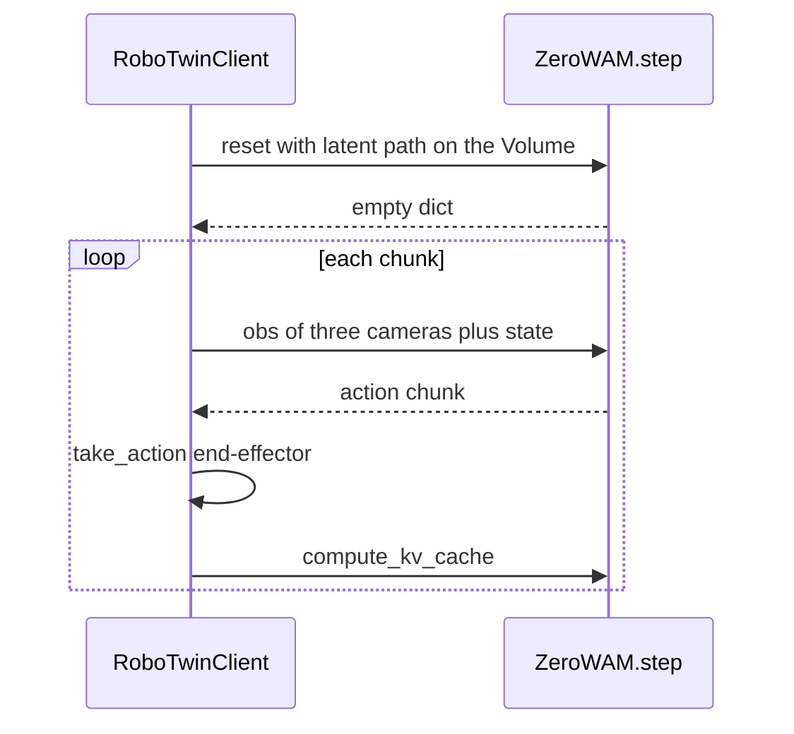

# Zero-WAM inference plan

Run one closed-loop rollout of the released RoboTwin post-train checkpoint. The simulator stays on this machine. The 11B model runs on a single Modal GPU.

Sources: [project page](https://robbyant-research.github.io/Zero-WAM/), [paper](2608.26103.pdf) ([text](2608.26103.txt)), [code](https://github.com/robbyant-research/Zero-WAM), [post-train weights](https://huggingface.co/Robbyant-Research/zero-wam-posttrain-robotwin), [HumanGen](https://huggingface.co/datasets/Robbyant-Research/HumanGen), [RoboTwin install](https://robotwin-platform.github.io/doc/usage/robotwin-install.html).

## Decision

Use RoboTwin 2.0 task `place_empty_cup` with `zero-wam-posttrain-robotwin`. That is the only closed-loop path the authors shipped. `place_empty_cup` is the strongest reported unseen task (84.87% in the paper). The instruction is one-arm ("place the empty cup on the coaster"). The robot is still a dual-arm Aloha: 16-D end-effector, left xyz + quaternion + gripper, then the same for the right arm. The released LeRobot metadata says `"robot_type": "aloha"`. The model’s internal action vector is 30-D; only 16 channels are used.

Post-training is a mixture, not RoboTwin alone. Section 4.2 starts from the pre-trained checkpoint and, for 4,000 steps, samples Task-diverse VA, HumanGen, and RoboTwin at 2:10:3. Task-diverse VA is language-only robot video. HumanGen adds a paired human video on top of the language instruction; the action branch never attends to that video. Simulation ICL is the RoboTwin slice of HumanGen (43 seen tasks, 7 held out). It is listed separately in the ratio so those 2,150 pairs are upweighted and the seven eval tasks stay excluded. The real bimanual-Franka pairs are a different post-train and are not this checkpoint.

Open X-Embodiment in that mixture includes single-arm Bridge / WidowX. The released server denormalizes actions with `wan_va/assets/norm_stats/robotwin_icl.json`, and the only shipped client is RoboTwin. A Bridge rollout would be a new client. This repo’s SO-101 MuJoCo scene is a different arm and a different action space.

## How a rollout is split

`VA_Server.infer` is three calls against one process. `reset` encodes the human video once and stores it as prefix memory. Later calls send the latest three camera frames plus proprioception and return the next action chunk (chunk size 2, 16 actions per frame, 50 denoising steps). A cache miss is a wrong action: the client does not resend the episode.

Inference is one GPU. The official launcher is already `torch.distributed.run --nproc_per_node 1`. On Modal, `max_containers=1` on a single `A100-80GB` is what makes every call hit that process. Sticky `Modal-Session-ID` routing is not a substitute. Modal rebalances sessions when the container set changes.

A public HTTP server, as in the [vLLM](https://modal.com/docs/examples/vllm_inference), [SGLang](https://modal.com/docs/examples/sglang_low_latency), and [DeepSeek-V4-Flash](https://modal.com/docs/examples/deepseek_v4_flash) examples, and `modal.forward`, stay out. Those fit a request that carries its own prompt.



This machine is an RTX 3070 Laptop with 8 GB. It runs SAPIEN only. Weights alone are about 23 GB. Whether the A100 80 GB holds the 50-step video and action denoisers is the smoke test below, not a second design.

## Modal app

New file `zero_wam/modal_app.py`.

- Image: Python 3.10, torch 2.9.0 / torchvision 0.24.0 / torchaudio 2.9.0 from the cu126 index, then Zero-WAM `requirements.txt` with `--no-build-isolation`. Copy the Zero-WAM repo into the image. Leave the checkpoint out of the image. Modal builds and caches this on the first `modal run`.
- Volume `zero-wam-weights`, mounted at `/models`. A one-shot function runs `snapshot_download("Robbyant-Research/zero-wam-posttrain-robotwin")` and the `place_empty_cup` human latent from `Robbyant-Research/HumanGen` (sample `273_robotwin_Use_an_arm_to_place_the_empty_cup_on_the_coaster` under `human_latents/robotwin/`). The server opens `icl_latent_path` on its own filesystem, so that file has to be on the Volume before the first reset. The download runs once. Later cold starts read the Volume at about 1–2 GB/s.
- Class `ZeroWAM`: `gpu="A100-80GB"`, `max_containers=1`, `scaledown_window` about 10 minutes, `startup_timeout` long enough to load ~23 GB. `@modal.enter` follows `wan_va.wan_va_server.run` for `config-name robotwin` (`init_distributed` with world size 1, `MODEL_PATH` on the Volume, `ICL_CFG=5`, `TARGET_TEXT_CFG=-1`) and constructs `VA_Server`. It does not call `run_async_server_mode`.
- `@modal.method() def step(self, obs) -> dict` returns `self.model.infer(obs)`. NumPy observations pickle through `.remote()`. Three 480×640 frames are about 2.8 MB, so Modal uploads them as a blob.

First check, before RoboTwin: `step.remote` with `reset=True` and the Volume latent path, then one fake observation. Expect an action whose leading dimension is 16.

## Local simulator

- Clone RoboTwin at `2eeec322` outside this repo’s SO-101 code, in its own Python 3.10 env. Follow the [official install](https://robotwin-platform.github.io/doc/usage/robotwin-install.html) (SAPIEN, CuRobo, mplib, assets). Vulkan is already present on this machine.
- Copy Zero-WAM’s `move_stapler_pad.py` and `stamp_seal.py` success-check patches in, per their `INSTALL.md`. `place_empty_cup` does not use them.
- Smoke-test with `evaluation/robotwin/test_render.py` on the 8 GB GPU. Motion planning and the renderer share that card.

Do not pull all of HumanGen. The eval client builds scenes from RoboTwin assets (`task_config: demo_clean`). The 1,000 released `place_empty_cup` episodes are optional inspection data, not an input to the rollout.

## Client

In a local checkout of Zero-WAM, replace the `WebsocketClientPolicy` construction in `evaluation/robotwin/eval_policy_client_openpi.py` with a thin object whose `infer(obs)` is `ZeroWAM().step.remote(obs)`. Leave the rest of `eval_policy` alone: reset, action chunk, `take_action(..., action_type='ee')`, then `compute_kv_cache`.

`icl_latent_path` in the reset dict is the path on the Modal Volume, not a path on this machine.

```bash
ICL_CFG=5 TARGET_TEXT_CFG=-1 SEED=0 TEST_NUM=1 \
bash evaluation/robotwin/launch_client.sh /path/to/eval_results place_empty_cup
```

Watch the mp4 under `save_root`. `TEST_NUM=100` and the other six unseen tasks (`stack_blocks_three`, `place_object_scale`, `stamp_seal`, `open_microwave`, `move_stapler_pad`, `place_bread_basket`) wait until that video looks like a rollout.

## Work list

1. Add `zero_wam/modal_app.py`: image, Volume download of the checkpoint plus the `place_empty_cup` latent, `ZeroWAM.step` wrapping `VA_Server.infer`.
2. Cold-start the class and confirm one fake observation returns a 16-D action.
3. Install RoboTwin `2eeec322` locally and pass `test_render.py`.
4. Point the eval client at `ZeroWAM().step.remote` and run `TEST_NUM=1` on `place_empty_cup`.
